# V3S — Design Diagram

A set of architecture diagrams (Mermaid) describing the **V3S Collaborative 3D Scene Editor**.
Render in any Mermaid-aware viewer (GitHub, VS Code Mermaid preview, mermaid.live).

- **Stack**: React 18 + Vite + Three.js + Zustand (frontend) · Node.js + Express + Socket.IO + TypeScript (backend)
- **Persistence (current)**: In-memory store with file snapshot (`backend/data/store.json`)
- **Persistence (target)**: PostgreSQL — schema in [`backend/sql/schema.sql`](../backend/sql/schema.sql)
- **Transport**: HTTPS (REST) + WebSocket (Socket.IO)
- **Auth**: JWT access + refresh tokens; guest tokens via invite codes

---

## 1. System Context (C4 - Level 1)

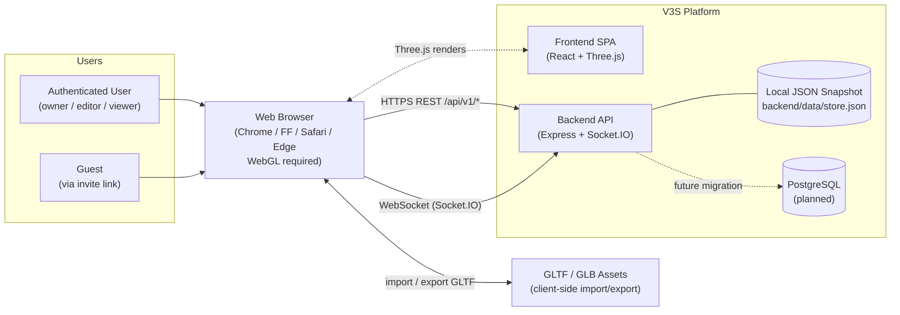

---

## 2. High-Level Architecture (C4 - Level 2 Container)

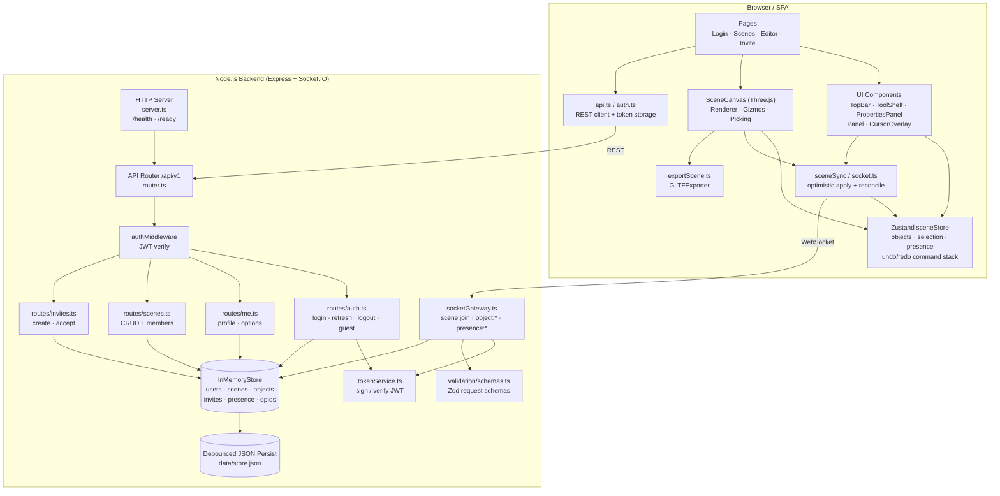

---

## 3. Frontend Component Diagram

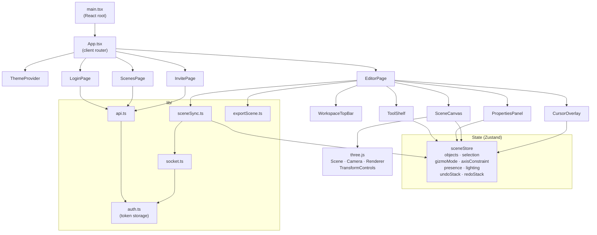

---

## 4. Backend Component Diagram

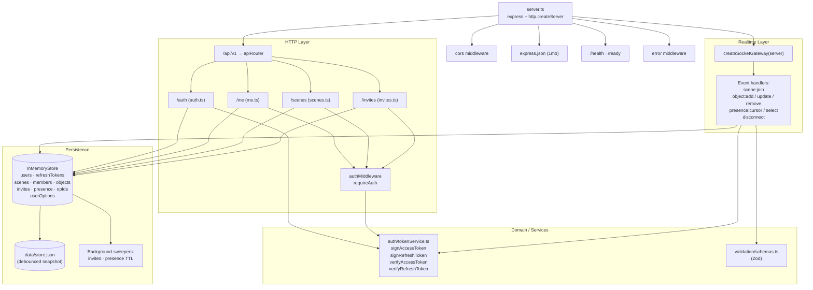

---

## 5. Data Model (target PostgreSQL schema)

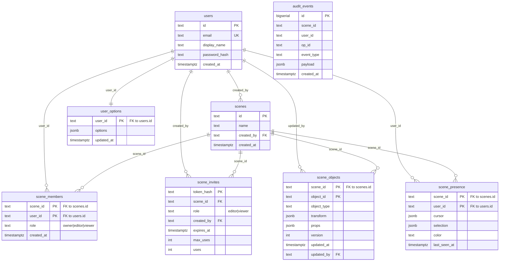

---

## 6. Authentication Flow (Sequence)

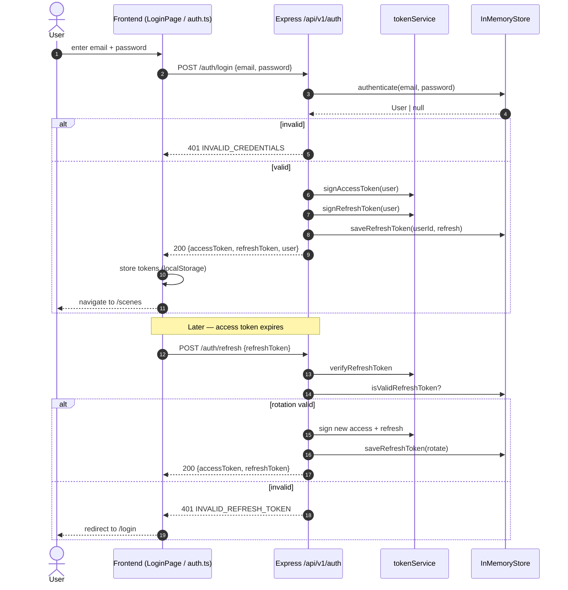

---

## 7. Realtime Collaboration Flow (Sequence)

Optimistic apply on initiating client, server reconciles via versioned object + opId dedup, broadcasts to peers.

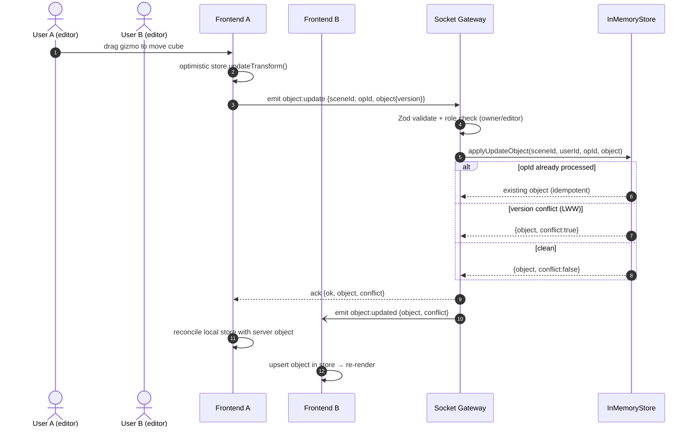

### Presence broadcast (throttled)

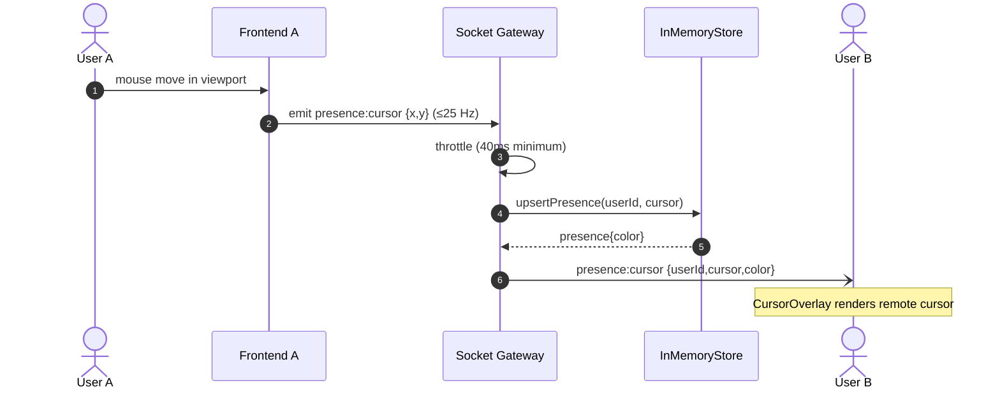

---

## 8. Scene Join + Snapshot (Sequence)

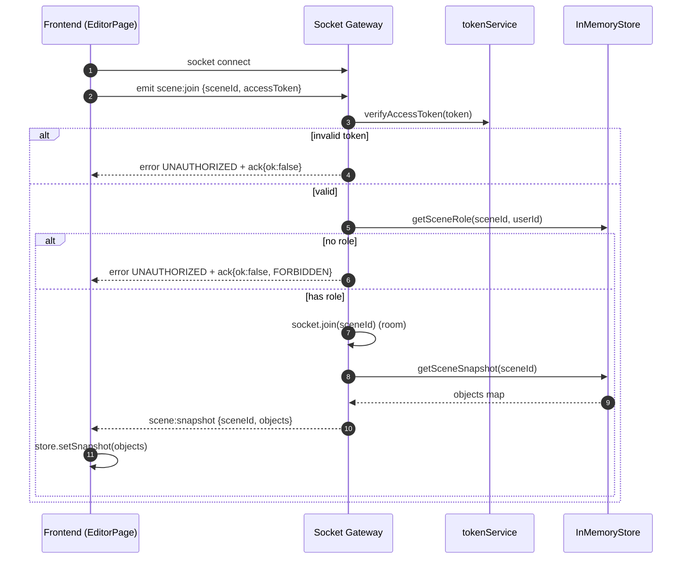

---

## 9. Guest / Invite Flow (Sequence)

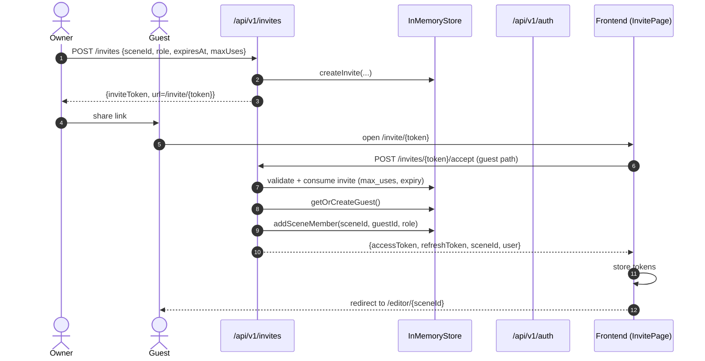

---

## 10. Undo / Redo (Command Pattern)

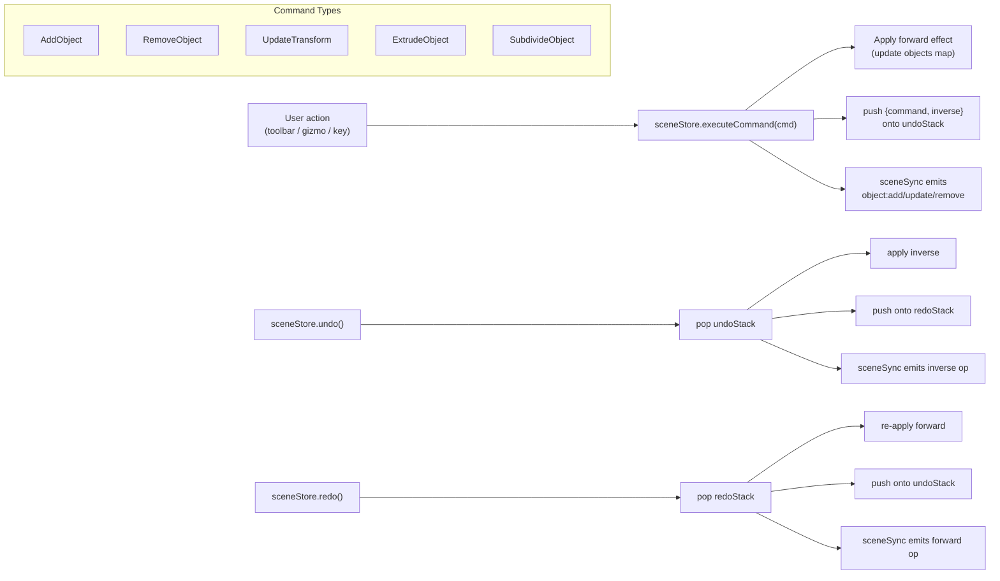

---

## 11. Deployment View

### Current (prototype / dev)

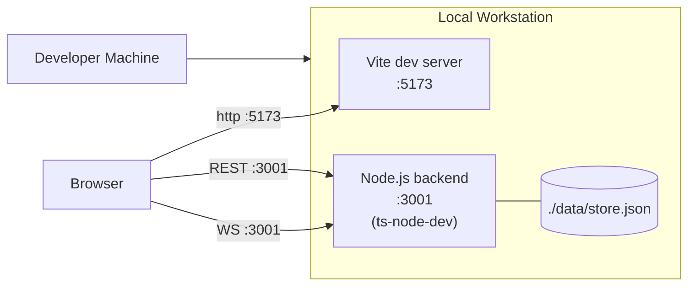

### Target (enterprise-ready)

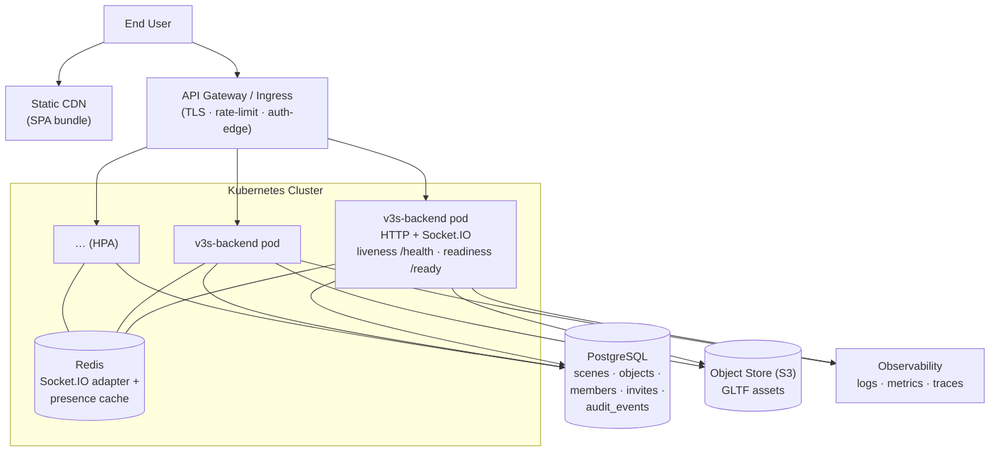

---

## 12. Cross-Cutting Concerns

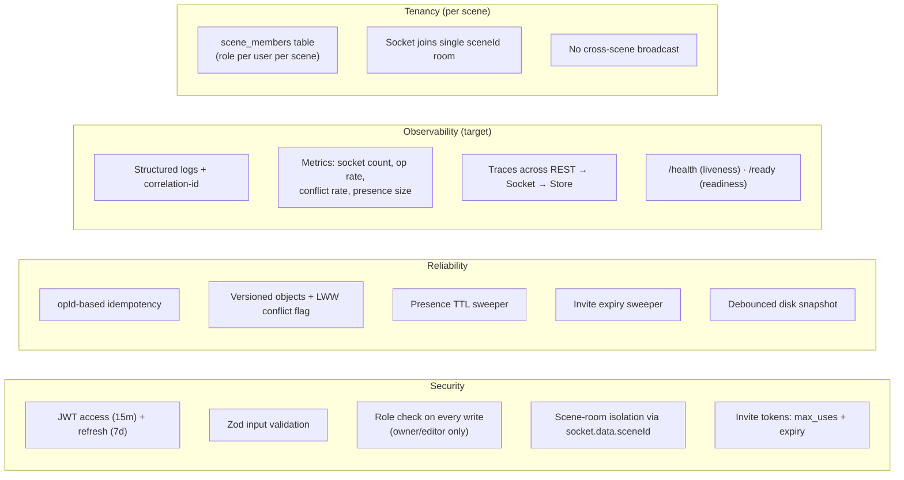

---

## 13. Key Endpoints & Events Reference

| REST endpoint                | Auth   | Purpose                         |
|------------------------------|--------|---------------------------------|
| `POST /api/v1/auth/login`    | none   | Email/password login            |
| `POST /api/v1/auth/guest`    | none   | Provision guest user            |
| `POST /api/v1/auth/refresh`  | none   | Rotate access + refresh tokens  |
| `POST /api/v1/auth/logout`   | bearer | Revoke refresh token            |
| `GET  /api/v1/me`            | bearer | Current user profile            |
| `GET  /api/v1/me/options`    | bearer | User preferences                |
| `PATCH /api/v1/me/options`   | bearer | Update preferences              |
| `GET  /api/v1/scenes`        | bearer | List scenes for user            |
| `POST /api/v1/scenes`        | bearer | Create scene                    |
| `GET  /api/v1/scenes/:id`    | bearer | Scene metadata + members        |
| `PATCH /api/v1/scenes/:id`   | bearer | Update scene (owner)            |
| `DELETE /api/v1/scenes/:id`  | bearer | Delete scene (owner)            |
| `POST /api/v1/invites`       | bearer | Create scene invite             |
| `POST /api/v1/invites/:t/accept` | mixed | Accept invite (guest/user)  |
| `GET  /health`               | none   | Liveness                        |
| `GET  /ready`                | none   | Readiness                       |

| Socket event (C→S)    | Payload                                                                  |
|-----------------------|--------------------------------------------------------------------------|
| `scene:join`          | `{ sceneId, token }`                                                     |
| `object:add`          | `{ sceneId, opId, object{id,type,transform,props,version?} }`            |
| `object:update`       | same shape as `object:add`                                               |
| `object:remove`       | `{ sceneId, opId, objectId, expectedVersion? }`                          |
| `presence:cursor`     | `{ sceneId, x, y }` (throttled 40ms)                                     |
| `presence:select`     | `{ sceneId, selection: string[] }`                                       |

| Socket event (S→C)    | Payload                                                                  |
|-----------------------|--------------------------------------------------------------------------|
| `scene:snapshot`      | `{ sceneId, objects }`                                                   |
| `object:added`        | `{ object }`                                                             |
| `object:updated`      | `{ object, conflict? }`                                                  |
| `object:removed`      | `{ objectId, conflict? }`                                                |
| `presence:cursor`     | `{ userId, cursor, color }`                                              |
| `presence:select`     | `{ userId, selection, color }`                                           |
| `presence:left`       | `{ userId }`                                                             |
| `error`               | `{ code, message? }`                                                     |

---

_Last updated: 2026-05-17 · derived from source in [backend/src](../backend/src) and [frontend/src](../frontend/src)._
